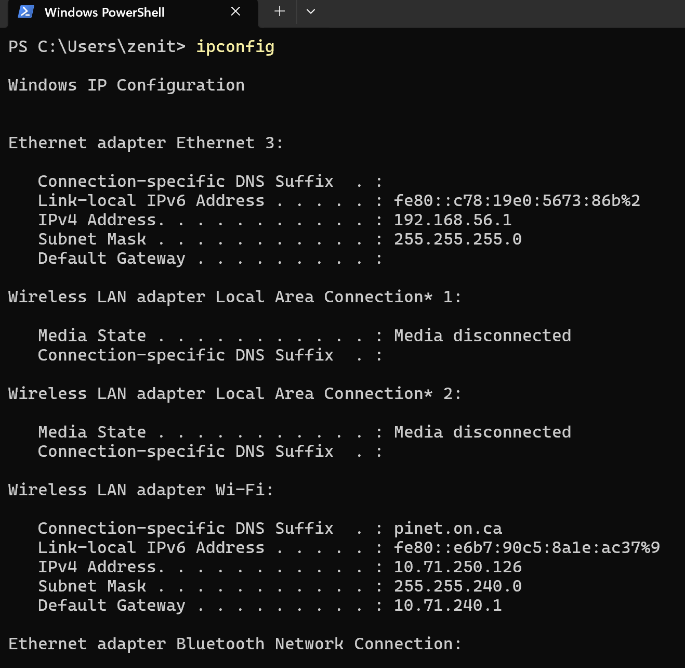
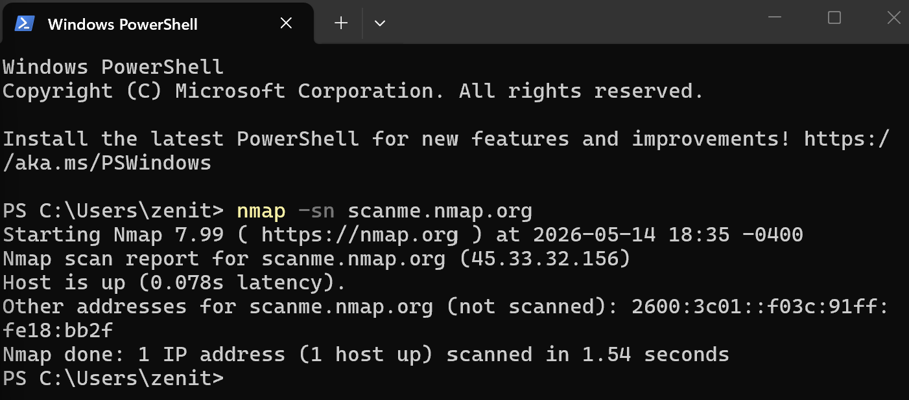
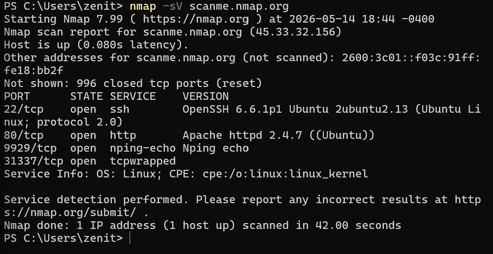
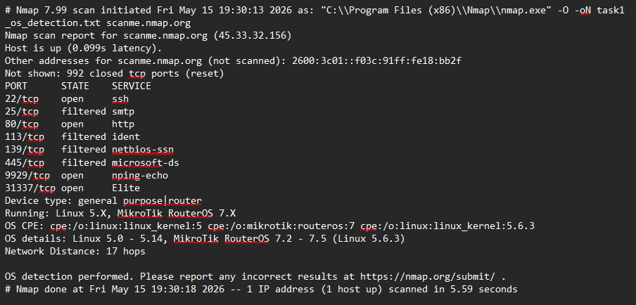
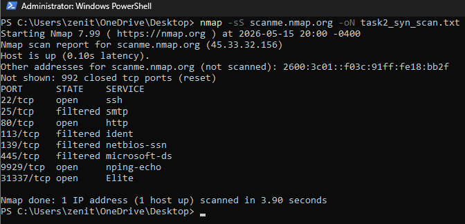

# Network Scanning and Host Enumeration with Nmap

## Project Objective

Nmap is a "Network Mapper" used to scan networks.

## Tools and Technologies Used


### Running a Basic Host Scan

I will be doing this on my local machine in Powershell.

> Powershell
> ```powershell
> ipconfig
> ```
_This command displays all current TCP/IP network configuration values._

Output:

> 

My current IP is 10.71.250.126. The subnet is 10.71.240.0/20.

### Scanning for Active Devices

I will be scanning for active devices on scanme.nmap.org instead of my current IP.

> Powershell
> ```powershell
> nmap -sn scanme.nmap.org
> ```

`sn` is a ping scan. The `n` stands for no port scan. This command tells Nmap to only perform host discovery. It sends a ping (ICMP) to the target to see if it’s "alive" but stops right there.

Output:

> 

### Port Scan and Service Detection

Now we will run a deeper scan to identify open ports and services.

> Powershell
> ```powershell
> nmap -sV scanme.nmap.org
> ```

`sV` is service/version detection: it probes open ports to identify exactly which software is running and its specific version number.

Output:

> 

Open ports:

- 22/tcp
- 80/tcp
- 9929/tcp
- 31337/tcp

Nmap reports: "Not shown: 996 closed tcp ports (reset)." This indicates that only 4 ports are open out of the 1000 scanned.

Services:

- Port 22: Used for Secure Shell (SSH), the industry-standard protocol for secure remote access to a server.
- Port 80: The standard port for unencrypted web traffic. It is used by web browsers to request and load traditional webpages.
- Port 9929: This is a non-standard port often associated with Nmap’s benchmarking or testing services.
- Port 31337: Famously known in the security community as the "Elite" (31337 = ELEET) port. It was historically used by various hacking groups and trojans as a default backdoor port.

Version Information:

- 22/tcp: OpenSSH — Commonly used for secure remote command-line access; the specific version (e.g., OpenSSH 8.2) identifies the software build and its associated security patches.
- 80/tcp: Hypertext Transfer Protocol (HTTP) — Frequently identified as Apache httpd, nginx, or a router's web management interface.
- 9929/tcp: nping-echo — A service specifically associated with Nmap's Nping echo tool, used for network troubleshooting and connectivity testing.
- 31337/tcp: Elite — Historically used by the Back Orifice trojan or other backdoor tools; its presence is a high-security risk often labeled as "Elite" in port databases.

Saving Results:

> Powershell
> ```powershell
> nmap -sV -oN scan_results.txt scanme.nmap.org
> ```

oN scan_results.txt (Nmap) → Outputs the scan results in normal text format to a file
named scan_results.txt for later review or reporting

### Document Findings

> 

10.71.250.126: The host is active and exposing four specific ports. Port 22 is running OpenSSH for secure remote management, while Port 80 provides a web interface, likely for a router or administrative console. Additionally, Port 9929 is active for Nping network testing, and Port 31337 is open, which is historically associated with the "Elite" backdoor or custom hacking tools. This combination of standard management ports and a high-risk "Elite" port suggests a system being used for technical testing or one that requires immediate security investigation.

### Investigate and Interpret

The IP address 10.71.250.126 identifies an active host on the network with a mix of expected and highly unusual services. While Port 22 (SSH) and Port 80 (HTTP) are standard for remote management and web interfaces, the presence of Port 9929 (Nping) and Port 31337 (Elite) stands out. The "Elite" port is particularly noteworthy as it is a classic indicator of a backdoor or unauthorized tool, which is not typically expected in a standard configuration. Fortunately, no legacy protocols like FTP or Telnet were detected, which reduces the risk of clear-text credential theft. However, the discovery of the "Elite" port highlights the need for further investigation to ensure the system hasn't been compromised or isn't running unauthorized scripts.

## Deeper Dive

### Operating System Detection

> Powershell
> ```powershell
> nmap -O scanme.nmap.org -oN task1_os_detection.txt
> ```

- Here we use the `-O` option to identify the operating system in use
- The `-oN` option saves formatted output to a file

> task1_os_detection.txt
>
> 

#### OS Fingerprint Section 

> Powershell
> ```powershell
> Device type: general purpose|router
> Running: Linux 5.X, MikroTik RouterOS 7.X
> OS CPE: cpe:/o:linux:linux_kernel:5 cpe:/o:mikrotik:routeros:7 cpe:/o:linux:linux_kernel:5.6.3
> OS details: Linux 5.0 - 5.14, MikroTik RouterOS 7.2 - 7.5 (Linux 5.6.3)
> Network Distance: 17 hops
> ```

Here Nmap offered OS guesses within specified ranges

#### Record Key Info

| Field | Value |
| :--- | :--- |
| **Target IP** | 45.33.32.156 (scanme.nmap.org) |
| **Detected OS** | Linux 5.X, MikroTik RouterOS 7.X |
| **OS Accuracy** | Not provided |
| **Device type** | general purpose\|router |
| **MAC Address** | Not provided (Target is on a remote network) |
| **Network Distance** | 17 hops |
| **Suspicious Mismatch?** | No. The detected Linux 5.X kernel matches the expected configuration for a public web and testing server like scanme.nmap.org. |

**Verification Analysis:**

A follow-up verification is not required as the initial operating system detection scan successfully mapped the open ports. The presence of standard Linux-centric services—specifically SSH (Port 22) and Nping-echo (Port 9929)—is entirely consistent with Nmap's OS fingerprint identifying the target as a general-purpose Linux 5.X environment. No structural discrepancies or unexpected mismatches were detected between the active services and the host operating system.

### TCP SYN Scan

This is to quickly find open ports without establishing a full network connection

> Powershell
> ```powershell
> nmap -sS scanme.nmap.org -oN task2_syn_scan.txt
> ```

- `-sS` is for the TCP scan. It is stealthy and fast.
- `oN` saves the output to a standard text file

Script output:

> 

# Lessons Learned

# Contact & Links

- LinkedIn: www.linkedin.com/in/zenithsaw

- GitHub: https://github.com/ZenithSaw12
